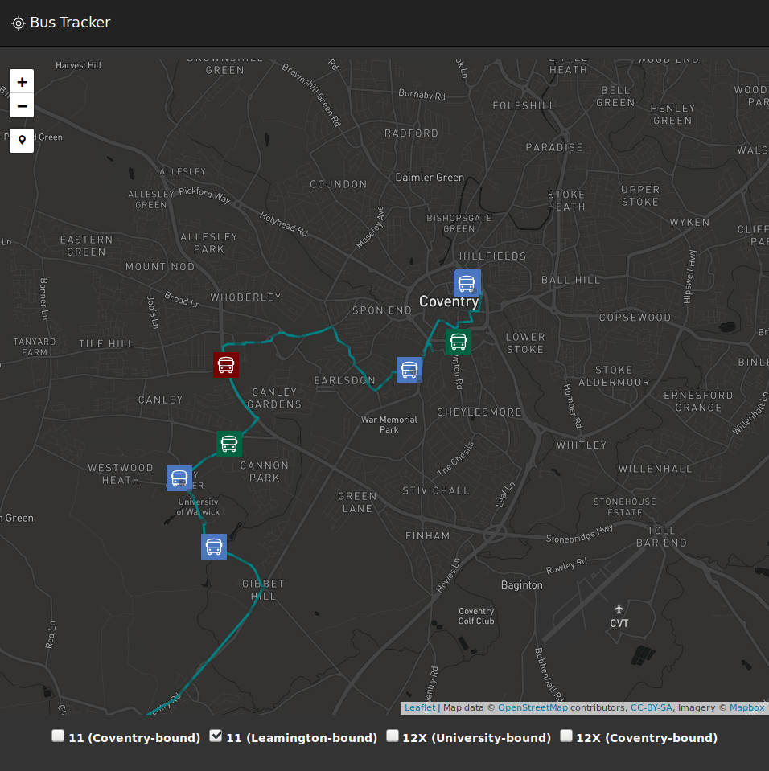

A web app to show live status of NX bus routes around Coventry, Kenilworth and Leamington.

BrowserStack
------------

This project has been tested for cross-browser support using access provided by BrowserStack's open source programme.

BrowserStack enables developers to test their web applications and native apps on a variety of real devices.

This project uses BrowserStack for testing the map on devices which the developer does not own (e.g. on iOS and macOS).
